# Yuki Okushi (JohnTitor)

Yuki Okushi is a FLOSS nerd, Japanese codewriting ninja, Rustacean, etc.

## My work

### Open Source

**You can support me via GitHub Sponsors: <https://github.com/sponsors/JohnTitor>**

@rust-lang

#### Teams/WGs

- community team
  - helping l10n and events
- crates.io team
  - developing backend of <https://crates.io>
- lang-docs team
  - lead of that team, maintaining [the nomicon](https://doc.rust-lang.org/nomicon/) and [the reference](https://github.com/rust-lang/reference)
- library-contributors team
  - reviewing/contributing to library-related things on rust-lang/rust and others (mainly the [libc](https://github.com/rust-lang/libc) crate)
- diagnostics, prioritization, rustc-dev-guide, triage WGs
  - keeping [rustc-dev-guide](https://rustc-dev-guide.rust-lang.org) up-to-date, improving diagnostics, and triaging issues/PRs/regressions

#### Related repositories

- [rust-lang/rust](https://github.com/rust-lang/rust)
  - sending/reviewing PRs, triaging issues, and making rollups regularly
- [rust-lang/libc](https://github.com/rust-lang/libc)
  - maintaining that crate as a core maintainer
- [rust-lang/rustc-dev-guide](https://github.com/rust-lang/rustc-dev-guide), [rust-lang/reference](https://github.com/rust-lang/reference), [rust-lang/nomicon](https://github.com/rust-lang/nomicon)
  - keeping them up-to-date

Rust community

#### Actix

- core team, current lead
  - If you find me as a lead of Actix, please also check [@robjtede](https://github.com/robjtede)'s work, they're one of the core as well and doing great work, and more active than I currently :)

#### notify-rs

- one of the active maintainers

#### Writing an OS in Rust (ja)

- Helping Japanese translations of [Writing an OS in Rust](https://os.phil-opp.com/) as a translator/reviewer

#### ...and so on and on!

In addition to the contributions listed here, I've made various other contributions to the Rust community.

Outside of Rust

- Node.js
  - i18n WG, working on i18n related things
    - Japanese proofreader of API-docs
  - moderation team member
- GNOME
  - GNOME foundation member
  - Helping Japanese translations
- LLVM
  - Committer
- Kubernetes
  - member, mainly contributing to docs and krew

### Job Experience

See my LAPRAS profile for details:

<!--START_SECTION:lapras-card-->
  
Last Updated on 12/13/2022, 9:45:53 PM UTC
<!--END_SECTION:lapras-card-->

## When there's no response from me for a while

My notification is flooding and I often overlook your email, ping, review request, etc.
When I don't respond for more than a week, feel free to ping me again or [open an issue here](https://github.com/JohnTitor/JohnTitor/issues), I'll prioritize it.
